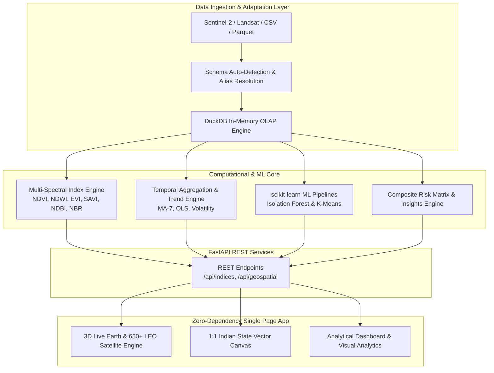

# 🛰️ SATELLITE INTELLIGENCE
### Autonomous Earth Observation Analytics & Geospatial Environmental Platform for India

---

## 🚀 Live Interactive Platform

Experience the full autonomous Earth Observation dashboard live in your browser:

### 🌐 **[https://satellite-intelligence-zv6c.onrender.com](https://satellite-intelligence-zv6c.onrender.com)**

> **Live Deployment Highlights:**
> * 🛰️ **3D Live Earth & LEO Constellations:** Real-time procedural 3D globe with 650+ satellites.
> * 🗺️ **1:1 Official Indian Geospatial Vectors:** Hardware-accelerated boundary mapping with zero lag.
> * 🔬 **Radiometric Indices & Climate Telemetry:** Instant calculation of NDVI, NDWI, EVI, SAVI, NDBI, NBR, and LST.
> * 🤖 **ML Outlier & Zonation Engine:** Real-time Isolation Forest anomaly detection and K-Means environmental clusters.
> * ⚡ **DuckDB OLAP Core:** Sub-millisecond analytical queries served directly via FastAPI.

---

## 🌍 Executive Overview

**SATELLITE INTELLIGENCE** is an enterprise-grade, dataset-adaptive Earth Observation (EO) and geospatial environmental analytics platform. Built from the ground up to address real-world climate risks and remote sensing challenges across the Indian subcontinent, the system combines **DuckDB in-memory columnar OLAP**, **scikit-learn unsupervised machine learning**, and an **embedded reactive Single Page Application (SPA)** with real-time **3D orbital mechanics**.

Whether processing multi-spectral Sentinel-2 bands, Landsat surface reflectance, or climate reanalysis grids, the platform automatically adapts its schema, calculates standard vegetation/water/urban indices, detects environmental anomalies, and renders crisp, official 1:1 vector state boundaries with zero browser lag.

---

## ✨ Key Capabilities & Innovations

### 1. 🌐 3D Live Earth & LEO Constellation Visualizer
* **Procedural 3D Canvas Globe:** Custom high-performance orthographic canvas projection rendering continents, latitude/longitude graticules, atmospheric glow, and axial rotation.
* **650+ Simulated LEO Satellites:** Multi-shell orbital physics modeling **Starlink**, **Polar Sun-Synchronous (SSO)**, **Commercial Earth Observation**, **Scientific Climate**, **GNSS Navigation**, and **Copernicus Sentinel** constellations.
* **Interactive Orbital Mechanics:** Real depth sorting with dynamic z-index sizing, solar illumination shading, orbital trail rendering, and interactive mouse drag rotation.

### 2. 🗺️ 1:1 Official Indian Geospatial Footprints
* **Accurate State & UT Boundaries:** Real boundary vector polygons for all major Indian States & Union Territories (Maharashtra, Karnataka, Tamil Nadu, Delhi NCT, Rajasthan, Gujarat, Kerala, West Bengal, Telangana, Assam, etc.).
* **Zero-Lag Vector Canvas:** Replaces slow third-party web map tiles with native hardware-accelerated 2D canvas drawing.
* **City & State Filtering:** Dynamic dual-selector linking 20 observation hubs with their parent states, showing observation density, spatial coverage radii, and coordinates.

### 3. 🔬 Multi-Spectral Satellite & Agro-Climatic Indices
* **Automated Band Derivation:** Real-time computation of standard radiometric indices:
  * **NDVI** (*Normalized Difference Vegetation Index*): Canopy health and photosynthetic activity.
  * **NDWI** (*Normalized Difference Water Index*): Surface water extent and reservoir storage.
  * **EVI** (*Enhanced Vegetation Index*): High-biomass canopy monitoring with atmospheric resistance.
  * **SAVI** (*Soil-Adjusted Vegetation Index*): Arid and semi-arid crop monitoring with soil brightness compensation.
  * **NDBI** (*Normalized Difference Built-up Index*): Urban sprawl and impervious surface density.
  * **NBR** (*Normalized Burn Ratio*): Wildfire burn scars and agricultural stubble burning.
* **Statistical Distribution:** Kernel-density and histogram binning with standard deviation markers.

### 4. 📈 High-Resolution Temporal Intelligence
* **Adaptive Aggregation:** Rolling time-series grouping by **Daily**, **Weekly**, or **Monthly** intervals.
* **Trend & Volatility Metrics:** 7-period Moving Averages, Ordinary Least Squares (OLS) linear trend slopes, rolling standard deviation bands, and seasonality diagnostics.
* **Composite Time Cards:** Instant computation of baseline mean, peak maximum, trough minimum, net percentage change, and standard deviation over the observation window.

### 5. 🤖 Machine Learning & Risk Intelligence
* **Unsupervised Anomaly Detection:** Spatial and spectral outlier isolation via scikit-learn **Isolation Forest** algorithms.
* **K-Means Clustering:** Multi-dimensional environmental zonation with automatic **Silhouette Score** validation.
* **Composite Environmental Risk Matrix:** Weighted multi-factor risk scoring incorporating vegetation stress, hydrologic deficits, thermal anomalies, and urban expansion.

### 6. 💡 Evidence-Backed Operational Insights
* 8 automated, rule-and-model-backed actionable intelligence cards providing field teams, urban planners, and agricultural departments with prioritized advisories.

---

## 🏛️ System Architecture

---

## 📡 REST API Reference

The platform includes a self-documenting FastAPI REST interface. Interactive OpenAPI documentation is accessible at **`https://satellite-intelligence-zv6c.onrender.com/docs`**.

| Endpoint | Method | Description | Key Parameters |
| :--- | :--- | :--- | :--- |
| `/api/health` | `GET` | Healthcheck and active system status | None |
| `/api/summary` | `GET` | High-level dataset statistics and metrics | None |
| `/api/indices` | `GET` | Derived multi-spectral radiometric indices | `index`, `region` |
| `/api/geospatial` | `GET` | 1:1 Indian state and city geospatial telemetry | `state`, `city` |
| `/api/temporal` | `GET` | Time-series trends and moving averages | `indicator`, `granularity` |
| `/api/anomalies` | `GET` | Unsupervised Isolation Forest outlier scores | `contamination` |
| `/api/clusters` | `GET` | Multi-spectral K-Means spatial clustering | `k` |
| `/api/risk-matrix` | `GET` | Multi-hazard environmental risk ranking | None |
| `/api/insights` | `GET` | Evidence-backed operational advisories | None |
| `/api/export` | `GET` | Export analytical subsets as CSV or Parquet | `format=csv\|parquet` |

---

## ⚙️ Configuration & Environment Variables

| Variable | Default | Description |
| :--- | :--- | :--- |
| `APP_HOST` / `HOST` | `127.0.0.1` | Network interface to bind to (`0.0.0.0` in cloud/Docker) |
| `APP_PORT` / `PORT` | `8000` | Port for the HTTP ASGI server |
| `SATELLITE_DATA_PATH` | *Empty* | Custom path to local CSV or Parquet telemetry file |
| `CACHE_TTL` | `300` | In-memory analytical cache expiration in seconds |
| `MAX_UPLOAD_MB` | `500` | Maximum file size for upload via web interface |
| `LOG_LEVEL` | `INFO` | Logging verbosity (`DEBUG`, `INFO`, `WARNING`, `ERROR`) |
| `AUTO_DOWNLOAD_INDIA_DATA`| `true` | Automated synthesis of India 20-city satellite telemetry |

---

## 🗺️ Geospatial Coverage (India)

The platform includes 1:1 official vector borders and meteorological telemetry across 20 primary observation centers:

* **Northern Region:** Srinagar (J&K), Delhi NCT, Jaipur (Rajasthan), Lucknow (Uttar Pradesh).
* **Western Region:** Ahmedabad (Gujarat), Mumbai (Maharashtra), Pune (Maharashtra), Nagpur (Maharashtra).
* **Central & Eastern Region:** Bhopal (Madhya Pradesh), Patna (Bihar), Ranchi (Jharkhand), Kolkata (West Bengal), Bhubaneswar (Odisha).
* **Southern Region:** Hyderabad (Telangana), Bengaluru (Karnataka), Chennai (Tamil Nadu), Kochi (Kerala), Thiruvananthapuram (Kerala).
* **Northeastern & Island Territories:** Guwahati (Assam), Port Blair (Andaman & Nicobar).

---

## 📜 License

This project is licensed under the **MIT License** — see the [LICENSE](LICENSE) file for details.

---

  <b>Built with ❤️ for Earth Observation, Climate Resilience, and Advanced Geospatial Intelligence.</b>

